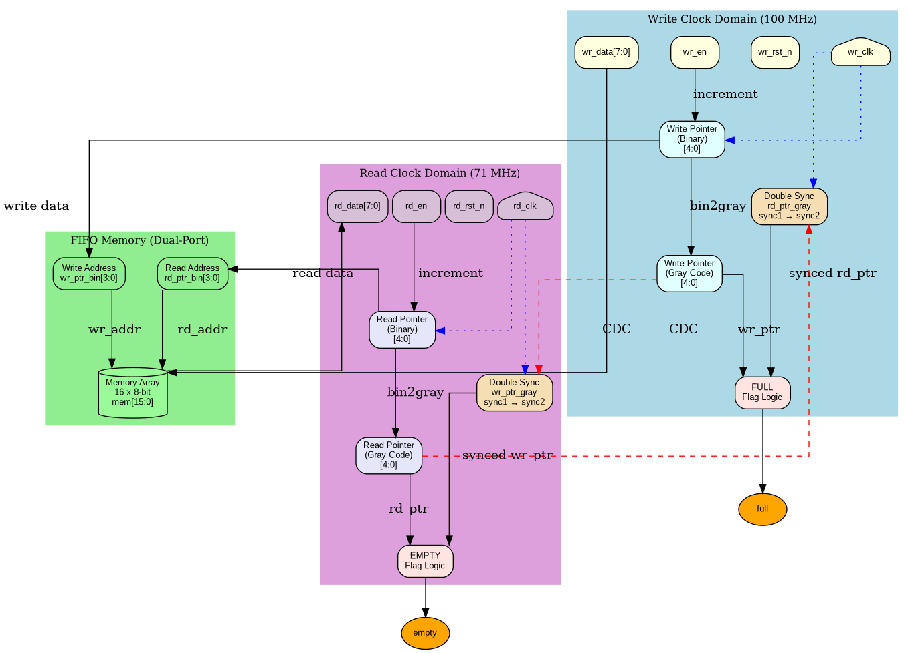
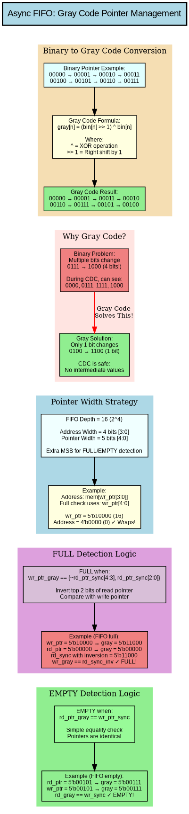
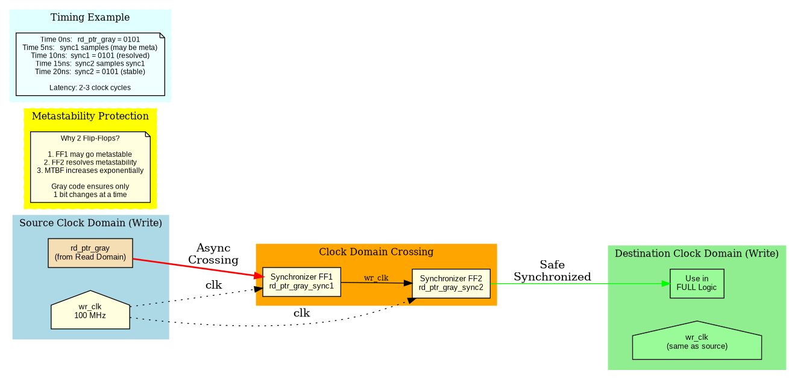
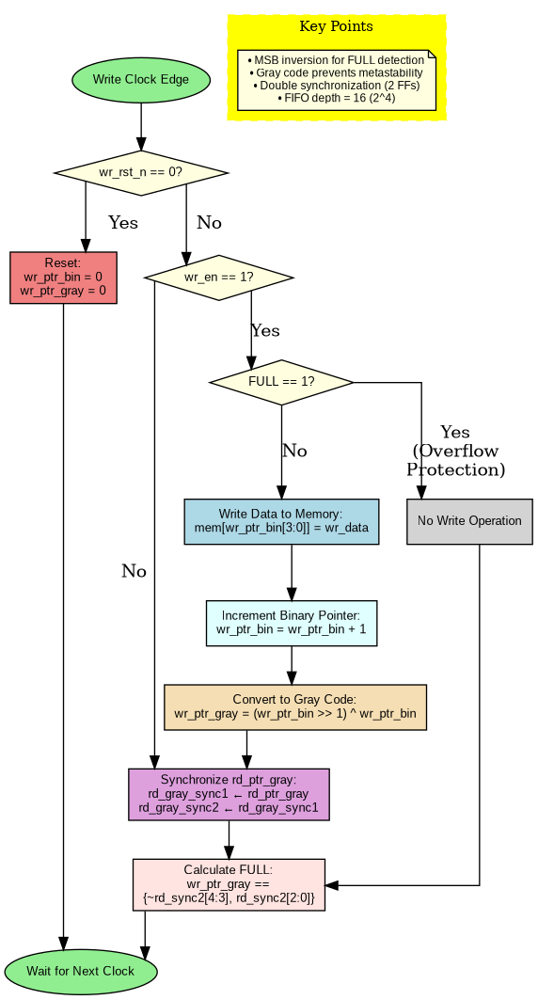
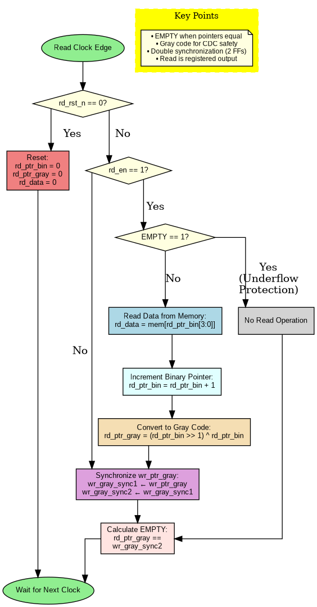

# Async_FIFO
# Asynchronous FIFO (First-In-First-Out) Design

A robust, synthesizable Asynchronous FIFO implementation in Verilog with comprehensive testbench and verification.

[](https://opensource.org/licenses/MIT)
[](https://en.wikipedia.org/wiki/Verilog)
[]()

---

## Table of Contents
- [Overview](#overview)
- [Features](#features)
- [Architecture](#architecture)
- [Key Concepts](#key-concepts)
- [Parameters](#parameters)
- [Interface Signals](#interface-signals)
- [Operation](#operation)
- [Simulation](#simulation)
- [Test Results](#test-results)
- [Synthesis Guidelines](#synthesis-guidelines)
- [References](#references)

---

## Overview

This Asynchronous FIFO design enables safe data transfer between two independent clock domains (100 MHz write clock and 71 MHz read clock). It uses **Gray code pointers** and **double synchronizers** to prevent metastability and ensure reliable clock domain crossing (CDC).

### Key Statistics
- **FIFO Depth**: 16 entries (configurable via ADDR_WIDTH)
- **Data Width**: 8 bits (configurable via DATA_WIDTH)
- **Write Clock**: 100 MHz (10 ns period)
- **Read Clock**: 71 MHz (14 ns period)
- **Latency**: 2-3 clock cycles for flag updates
- **Area**: Minimal (16x8 memory + control logic + 10 flip-flops)

---

## Features

✅ **Dual Independent Clock Domains**
- Write domain: 100 MHz
- Read domain: 71 MHz
- Asynchronous operation with safe CDC

✅ **Gray Code Pointer Implementation**
- Only 1 bit changes per increment
- Eliminates multi-bit transition glitches
- Safe for clock domain crossing

✅ **Double Synchronization**
- 2-stage flip-flop synchronizers
- Resolves metastability
- High MTBF (Mean Time Between Failures)

✅ **Robust Flag Generation**
- **FULL**: Prevents write overflow
- **EMPTY**: Prevents read underflow
- Accurate across clock domains

✅ **Parameterizable Design**
- Configurable data width
- Configurable FIFO depth
- Easy to scale

✅ **Comprehensive Testbench**
- Reset test
- Fill/empty tests
- Simultaneous read/write
- Random traffic
- Pointer wraparound
- Self-checking with reference model

---

## Architecture



### Block Diagram Components

#### 1. Write Clock Domain (100 MHz)
- **Write Pointer (Binary)**: 5-bit counter [4:0]
- **Write Pointer (Gray)**: Binary-to-Gray converted
- **Double Synchronizer**: Synchronizes read pointer from read domain
- **FULL Flag Logic**: Compares write and synchronized read pointers

#### 2. FIFO Memory (Dual-Port)
- **Size**: 16 locations × 8 bits
- **Write Port**: Addressed by `wr_ptr_bin[3:0]`
- **Read Port**: Addressed by `rd_ptr_bin[3:0]`
- **Type**: Asynchronous read, synchronous write

#### 3. Read Clock Domain (71 MHz)
- **Read Pointer (Binary)**: 5-bit counter [4:0]
- **Read Pointer (Gray)**: Binary-to-Gray converted
- **Double Synchronizer**: Synchronizes write pointer from write domain
- **EMPTY Flag Logic**: Compares read and synchronized write pointers

---

## Key Concepts

### 1. Gray Code Encoding



**Why Gray Code?**

| Binary Counter | Problem | Gray Code Solution |
|----------------|---------|-------------------|
| 0111 → 1000 | 4 bits change! | 0100 → 1100 (only 1 bit) |
| Metastability risk | During CDC, can read intermediate values | Safe CDC crossing |

**Binary to Gray Conversion Formula:**
```verilog
gray[n] = (binary[n] >> 1) ^ binary[n]
```

**Example:**
```
Binary: 00000 → 00001 → 00010 → 00011 → 00100 → 00101
Gray:   00000 → 00001 → 00011 → 00010 → 00110 → 00111
        Only 1 bit changes at each transition ✓
```

### 2. Clock Domain Crossing (CDC)



**Double Synchronizer Architecture:**

```
Read Domain          CDC           Write Domain
rd_ptr_gray ──────►(FF1)────►(FF2)────► rd_ptr_gray_sync2
               metastable    stable        
               may settle   resolved       
```

**Synchronization Stages:**
1. **Stage 1 (sync1)**: May go metastable when sampling async signal
2. **Stage 2 (sync2)**: Resolves any metastability from Stage 1
3. **Latency**: 2-3 clock cycles
4. **MTBF**: Increases exponentially with 2 FFs

**Why This Works:**
- Gray code ensures only 1 bit toggles
- First FF captures the change (might be metastable)
- Second FF provides time for metastability to resolve
- Destination logic uses stable sync2 output

### 3. Pointer Width Strategy

**Why 5 bits for 16-deep FIFO?**

- **Address Width**: 4 bits [3:0] → 16 locations (2^4)
- **Pointer Width**: 5 bits [4:0] → Extra MSB for FULL/EMPTY

**Example:**
```
FIFO Depth = 16
Address: wr_ptr[3:0]  → 0, 1, 2, ..., 15, 0, 1, ... (wraps at 16)
Pointer: wr_ptr[4:0]  → 0, 1, 2, ..., 15, 16, 17, ... (distinguishes full from empty)
```

### 4. FULL and EMPTY Detection

#### FULL Detection Logic
```verilog
full = (wr_ptr_gray == {~rd_ptr_gray_sync2[4:3], rd_ptr_gray_sync2[2:0]})
```

**How it works:**
1. Invert top 2 MSBs of synchronized read pointer
2. Compare with write pointer in Gray code
3. FULL when they match

**Example (FIFO Full):**
```
Write pointer:  10000 (binary) → 11000 (gray)
Read pointer:   00000 (binary) → 00000 (gray)
After sync + inversion:          11000
Match! → FULL asserted ✓
```

**Why invert MSBs?**
- Write pointer has wrapped around once more than read pointer
- MSB difference indicates "one full lap ahead"

#### EMPTY Detection Logic
```verilog
empty = (rd_ptr_gray == wr_ptr_gray_sync2)
```

**How it works:**
1. Compare read pointer with synchronized write pointer
2. EMPTY when they're exactly equal
3. Simple equality check

**Example (FIFO Empty):**
```
Read pointer:  00101 (binary) → 00111 (gray)
Write pointer: 00101 (binary) → 00111 (gray)
After sync:                      00111
Match! → EMPTY asserted ✓
```

---

## Parameters

| Parameter | Default | Description |
|-----------|---------|-------------|
| `DATA_WIDTH` | 8 | Width of data bus in bits |
| `ADDR_WIDTH` | 4 | Address width (FIFO depth = 2^ADDR_WIDTH) |
| `DEPTH` | 16 | Calculated as 1 << ADDR_WIDTH |

### Example Configurations

```verilog
// 16-deep, 8-bit wide (default)
async_fifo #(.DATA_WIDTH(8), .ADDR_WIDTH(4)) fifo_inst (...);

// 32-deep, 16-bit wide
async_fifo #(.DATA_WIDTH(16), .ADDR_WIDTH(5)) fifo_inst (...);

// 64-deep, 32-bit wide
async_fifo #(.DATA_WIDTH(32), .ADDR_WIDTH(6)) fifo_inst (...);
```

---

## Interface Signals

### Input Ports

| Signal | Width | Clock Domain | Description |
|--------|-------|--------------|-------------|
| `wr_clk` | 1 | Write | Write clock (100 MHz in testbench) |
| `rd_clk` | 1 | Read | Read clock (71 MHz in testbench) |
| `wr_rst_n` | 1 | Write | Active-low reset for write domain |
| `rd_rst_n` | 1 | Read | Active-low reset for read domain |
| `wr_en` | 1 | Write | Write enable (ignored if FULL) |
| `rd_en` | 1 | Read | Read enable (ignored if EMPTY) |
| `wr_data` | DATA_WIDTH | Write | Data to be written to FIFO |

### Output Ports

| Signal | Width | Clock Domain | Description |
|--------|-------|--------------|-------------|
| `rd_data` | DATA_WIDTH | Read | Data read from FIFO (registered) |
| `full` | 1 | Write | Asserted when FIFO is full |
| `empty` | 1 | Read | Asserted when FIFO is empty |

---

## Operation

### Write Operation



**Write Cycle:**
1. Check `wr_rst_n`
   - If reset, clear all write pointers
2. Check `wr_en` and `!full`
   - If both true, proceed to write
3. Write data to memory: `mem[wr_ptr_bin[3:0]] <= wr_data`
4. Increment binary pointer: `wr_ptr_bin <= wr_ptr_bin + 1`
5. Convert to Gray code: `wr_ptr_gray <= (wr_ptr_bin >> 1) ^ wr_ptr_bin`
6. Synchronize read pointer for FULL check
7. Update FULL flag

**Timing:**
```
wr_clk    ___╱‾‾‾╲___╱‾‾‾╲___╱‾‾‾╲___
wr_en     ‾‾‾‾‾‾‾‾‾‾‾‾‾‾‾‾‾╲________
wr_data   ====< 0xA5 >====< 0xB6 >==
full      _________________________
Memory    [addr] <= 0xA5
          wr_ptr: 0→1
```

### Read Operation



**Read Cycle:**
1. Check `rd_rst_n`
   - If reset, clear all read pointers and output
2. Check `rd_en` and `!empty`
   - If both true, proceed to read
3. Read data from memory: `rd_data <= mem[rd_ptr_bin[3:0]]`
4. Increment binary pointer: `rd_ptr_bin <= rd_ptr_bin + 1`
5. Convert to Gray code: `rd_ptr_gray <= (rd_ptr_bin >> 1) ^ rd_ptr_bin`
6. Synchronize write pointer for EMPTY check
7. Update EMPTY flag

**Timing:**
```
rd_clk    ___╱‾‾‾╲___╱‾‾‾╲___╱‾‾‾╲___
rd_en     ‾‾‾‾‾‾‾‾‾‾‾‾‾‾‾‾‾╲________
rd_data   ========< 0xA5 >==< 0xB6 >
empty     _________________________
Memory    rd_data <= mem[addr]
          rd_ptr: 0→1
```

---

## Simulation

### Running the Testbench

#### Using VCS (Synopsys)
```bash
# Compile
vcs -full64 -sverilog +v2k \
    -timescale=1ns/1ps \
    -debug_access+all \
    async_fifo.v async_fifo_tb.v

# Run simulation
./simv

# View waveforms
dve -vpd vcdplus.vpd &
```

#### Using Icarus Verilog
```bash
# Compile and run
iverilog -o async_fifo.vvp async_fifo.v async_fifo_tb.v
vvp async_fifo.vvp

# View waveforms
gtkwave async_fifo.vcd &
```

#### Using ModelSim/Questa
```bash
# Compile
vlog async_fifo.v async_fifo_tb.v

# Simulate
vsim -c async_fifo_tb -do "run -all; quit"

# View waveforms
vsim async_fifo_tb
```

### Test Scenarios

The testbench includes 5 comprehensive tests:

#### 1. Reset Test
```
✓ Verifies FIFO is empty after reset
✓ Checks all pointers are cleared
```

#### 2. Fill FIFO Test
```
✓ Writes 16 data values (0 to 15)
✓ Attempts 2 more writes (overflow protection)
✓ Verifies FULL flag asserts correctly
```

#### 3. Empty FIFO Test
```
✓ Reads all 16 values
✓ Attempts 2 more reads (underflow protection)
✓ Verifies EMPTY flag asserts correctly
✓ Checks data integrity (matches reference)
```

#### 4. Simultaneous Read/Write
```
✓ Concurrent operations (50 writes, 50 reads)
✓ Tests asynchronous behavior
✓ Verifies flags update correctly
```

#### 5. Random Traffic
```
✓ 200 random read/write operations
✓ Stresses CDC logic
✓ Validates Gray code pointers
```

#### 6. Pointer Wraparound
```
✓ Writes/reads 48 values (3× FIFO depth)
✓ Tests pointer wrapping at boundaries
✓ Ensures correct modulo addressing
```

---

## Test Results

### Expected Console Output
```
TEST: Fill FIFO
TEST: Empty FIFO
TEST: Simultaneous R/W
TEST: Random traffic
TEST: Pointer wrap
ALL TESTS PASSED ✅
```

### Key Waveform Observations

#### 1. Reset Behavior
```
Time: 0-60ns
wr_rst_n: 0 → 1
rd_rst_n: 0 → 1
empty: 1 (asserted after reset)
full: 0
all pointers: 0
```

#### 2. Write Until Full
```
Time: 60-300ns
wr_en: pulsing
wr_data: 0x00, 0x01, 0x02, ..., 0x0F
wr_ptr_bin: 0→1→2→...→16
full: 0→0→...→1 (when wr_ptr wraps)
```

#### 3. Read Until Empty
```
Time: 300-600ns
rd_en: pulsing
rd_data: 0x00, 0x01, 0x02, ..., 0x0F (matches write)
rd_ptr_bin: 0→1→2→...→16
empty: 0→0→...→1 (when pointers match)
```

#### 4. CDC Latency
```
Write pointer changes at time T
Synchronized in read domain at time T + 2-3 rd_clk cycles
EMPTY flag updates accordingly
```

---

## Synthesis Guidelines

### Recommended Constraints

```tcl
# Create clocks
create_clock -name wr_clk -period 10.0 [get_ports wr_clk]
create_clock -name rd_clk -period 14.0 [get_ports rd_clk]

# Asynchronous clocks
set_clock_groups -asynchronous \
    -group [get_clocks wr_clk] \
    -group [get_clocks rd_clk]

# False paths on Gray code pointers
set_false_path -from [get_cells wr_ptr_gray*] -to [get_cells rd_ptr_gray_sync1*]
set_false_path -from [get_cells rd_ptr_gray*] -to [get_cells wr_ptr_gray_sync1*]

# Sync chain max delay
set_max_delay -from [get_cells *sync1*] -to [get_cells *sync2*] [get_clocks *_clk]
```

### Synthesis Tips

1. **Don't optimize synchronizers**
   ```tcl
   set_dont_touch [get_cells *sync1*]
   set_dont_touch [get_cells *sync2*]
   ```

2. **Memory inference**
   - Most tools will infer dual-port RAM
   - May use BRAM/block RAM in FPGAs

3. **Timing closure**
   - Synchronizers add 2-3 cycle latency
   - Fast clock domain may need special attention

---

## Design Trade-offs

### Advantages
✅ Safe CDC with Gray code  
✅ Low latency (2-3 cycles for flag updates)  
✅ No handshaking required  
✅ Minimal area overhead  
✅ Scalable to any depth/width  

### Limitations
⚠️ Fixed depth at synthesis time  
⚠️ 2-3 cycle latency for flags  
⚠️ Slightly more complex than sync FIFO  
⚠️ Requires careful constraint setup  

---

## Comparison: Async vs Sync FIFO

| Feature | Async FIFO | Sync FIFO |
|---------|------------|-----------|
| **Clock Domains** | 2 independent | 1 shared |
| **Pointer Encoding** | Gray code | Binary |
| **Synchronizers** | Required (2-FF) | Not needed |
| **Area** | +10-15% | Baseline |
| **Latency** | 2-3 cycles | 1 cycle |
| **Complexity** | Higher | Lower |
| **Use Case** | CDC required | Same clock domain |

---

## Common Pitfalls & Solutions

### ❌ Problem 1: Metastability
**Issue**: Direct pointer comparison across clock domains  
**Solution**: ✅ Use Gray code + double synchronizers

### ❌ Problem 2: False FULL/EMPTY
**Issue**: Multi-bit pointer transitions  
**Solution**: ✅ Gray code ensures 1-bit changes

### ❌ Problem 3: Synthesis removes sync FFs
**Issue**: Tool optimizes away "redundant" synchronizers  
**Solution**: ✅ Use `dont_touch` attributes

### ❌ Problem 4: Timing violations on CDC paths
**Issue**: Setup/hold violations on async paths  
**Solution**: ✅ Set false_path and max_delay constraints

## References

### Academic Papers
1. Clifford E. Cummings, "Simulation and Synthesis Techniques for Asynchronous FIFO Design"
2. Gray, Frank (1953). "Pulse code communication"

### Design Guides
- Synopsys "Constraining Asynchronous Clock Domain Crossings"
- Xilinx WP272 "Get Smart About Reset"
- ARM "AMBA AXI Protocol Specification" (async FIFO usage)

### Online Resources
- [Verilog Pro - Async FIFO](http://www.verilogpro.com)
- [ASIC World - FIFO](http://www.asic-world.com)
- [Clock Domain Crossing](http://www.sunburst-design.com)

---


